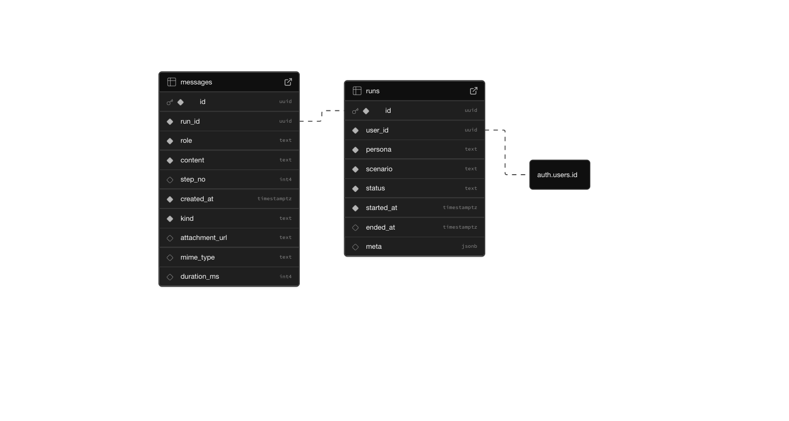

# Bank Simulator 🏦

A training simulation where learners practice handling bank customer support interactions. Built as a full-stack project with scripted customer responses and rule-based conversation flow.

## How to Run Locally

### Prerequisites
- Node.js 18+ 
- A Supabase project (free tier works)

### Setup
1. **Clone and install**
   ```bash
   git clone https://github.com/kylengn/bank-simulator
   cd bank-simulator
   npm install
   ```

2. **Environment setup**
   Create a `.env.local` file:
   ```env
   NEXT_PUBLIC_SUPABASE_URL=your_supabase_project_url
   NEXT_PUBLIC_SUPABASE_ANON_KEY=your_supabase_anon_key
   ```

3. **Database setup**
   
   **Schema Overview:**
   
   
   
   Run these SQL queries in your Supabase SQL editor:
   
   **Create tables:**
   ```sql
   -- (optional safety) ensure pgcrypto is available for gen_random_uuid()
   create extension if not exists pgcrypto;

   -- 1) RUNS: one row per simulation session
   create table if not exists public.runs (
     id uuid primary key default gen_random_uuid(),
     user_id uuid not null references auth.users(id) on delete cascade,
     persona text not null,          -- e.g. "Stressed mortgage borrower"
     scenario text not null,         -- e.g. "Card declined while traveling"
     status text not null default 'active' check (status in ('active','ended','aborted')),
     started_at timestamptz not null default now(),
     ended_at timestamptz,
     meta jsonb                      -- freeform room for extras
   );

   -- 2) MESSAGES: chat turns within a run
   -- role is who sent the message: 'agent' (you), 'customer' (persona), or 'system'
   create table if not exists public.messages (
     id uuid primary key default gen_random_uuid(),
     run_id uuid not null references public.runs(id) on delete cascade,
     role text not null check (role in ('agent','customer','system')),
     content text not null,
     step_no int,                    -- optional: stage in the scripted flow
     created_at timestamptz not null default now()
   );
   ```

   **Set up Row Level Security (RLS):**
   ```sql
   -- Enable RLS
   alter table public.runs enable row level security;
   alter table public.messages enable row level security;

   -- R U N S  policies
   -- Read: only owner can SELECT their runs
   create policy "runs_select_own"
   on public.runs
   for select
   using (auth.uid() = user_id);

   -- Insert: only authenticated user can create a run for themselves
   create policy "runs_insert_own"
   on public.runs
   for insert
   with check (auth.uid() = user_id);

   -- Update: only owner can update their runs (e.g., set ended_at/status)
   create policy "runs_update_own"
   on public.runs
   for update
   using (auth.uid() = user_id);

   -- Delete: only owner can delete their runs
   create policy "runs_delete_own"
   on public.runs
   for delete
   using (auth.uid() = user_id);

   -- M E S S A G E S  policies
   -- Helper rule: message access is granted if the parent run belongs to the user
   -- We express that with an EXISTS() check against runs.
   create policy "messages_select_by_run_owner"
   on public.messages
   for select
   using (
     exists (
       select 1 from public.runs r
       where r.id = public.messages.run_id
         and r.user_id = auth.uid()
     )
   );

   create policy "messages_insert_by_run_owner"
   on public.messages
   for insert
   with check (
     exists (
       select 1 from public.runs r
       where r.id = run_id
         and r.user_id = auth.uid()
     )
   );

   create policy "messages_update_by_run_owner"
   on public.messages
   for update
   using (
     exists (
       select 1 from public.runs r
       where r.id = public.messages.run_id
         and r.user_id = auth.uid()
     )
   );

   create policy "messages_delete_by_run_owner"
   on public.messages
   for delete
   using (
     exists (
       select 1 from public.runs r
       where r.id = public.messages.run_id
         and r.user_id = auth.uid()
     )
   );
   ```

   **Add indexes for performance:**
   ```sql
   -- Fast queries by user/time
   create index if not exists runs_user_started_idx
     on public.runs (user_id, started_at desc);

   -- Fast loading of chat for a run
   create index if not exists messages_run_created_idx
     on public.messages (run_id, created_at);
   ```

   **Add audio support columns:**
   ```sql
   alter table public.messages
     add column if not exists kind text not null default 'text' check (kind in ('text','audio','video')),
     add column if not exists attachment_url text,
     add column if not exists mime_type text,
     add column if not exists duration_ms int;
   ```

   **Additional Supabase setup:**
   - Enable real-time subscriptions for the `messages` table
   - Set up authentication (email magic links)
   - Create a storage bucket named `audio-messages` for voice recordings

4. **Run the app**
   ```bash
   npm run dev
   ```
   Open [http://localhost:3000](http://localhost:3000)

## Architecture Overview

**User Flow:**
```
Landing Page → Email Auth → Simulation Setup → Chat Interface
```

**Tech Stack (per requirements):**
- **Frontend**: React + Next.js (App Router)
- **Backend & Data**: Supabase (PostgreSQL, Auth, Realtime)
- **UI**: Tailwind CSS + shadcn/ui components
- **Real-time**: Supabase Realtime channels
- **Deployment**: Vercel

**Core Components:**
- **Rules Engine**: Keyword-based conversation flow logic
- **AuthProvider**: Global authentication state management  
- **ChatView**: Real-time conversation interface with TTS
- **AudioRecorder**: Voice message recording capability
- **Simulation Picker**: Random persona/scenario selection

## Scenarios & Personas

### Customer Personas (randomly selected)
- **Stressed Traveler**: Urgent, emotional, needs quick resolution
- **Busy Small-Business Owner**: Professional, time-sensitive, direct
- **New Cardholder, Confused about Online Banking**: Uncertain, needs guidance

### Banking Scenarios (randomly selected)
- **Card Lost**: Emergency card blocking and replacement process
- **Transfer Failed**: Troubleshooting failed payment transfers  
- **Account Locked**: Security verification and account restoration

Each simulation randomly picks one persona + one scenario. The conversation follows a rule-based flow where the "customer" responds based on specific keywords the agent mentions, advancing through structured steps toward resolution.

### How the Flow Works ‼️

**For Agents (Users):** To succeed in each scenario, you need to mention specific keywords at each step. The customer will respond positively when you hit the right keywords, or give you hints when you miss them.

**Example - "Card Lost" Scenario Flow:**

**Step 1: Verify Identity** 
- **Goal**: Show empathy and gather verification details
- **Keywords to mention**: "verify", "security", "full name", "date of birth", "help", "understand"
- **✅ Success**: Customer provides name and DOB, asks you to block the card
- **❌ Miss**: Customer stays panicked, asks what verification you need

**Step 2: Block the Card**
- **Goal**: Confirm card details and take action  
- **Keywords to mention**: "card number", "last 4 digits", "block", "freeze", "protect"
- **✅ Success**: Customer gives last 4 digits, asks about replacement timeline
- **❌ Miss**: Customer worries about fraud, asks about the blocking process

**Step 3: Arrange Replacement**
- **Goal**: Explain replacement process and options
- **Keywords to mention**: "replacement", "new card", "expedite", "timeline", "delivery", "address"
- **✅ Success**: Customer requests expedited delivery, conversation concludes
- **❌ Miss**: Customer asks how long it takes and if you can rush it

**💡 Pro Tips:**
- Each scenario has 3 structured steps that mirror real banking protocols
- Listen to customer hints in their responses - they guide you to the right keywords
- The step indicator shows your progress: "You're on step X"
- Practice different approaches to see how keyword matching works

## Implemented Extensions

**Chose: Audio and/or Video**

**Why**: Adding voice interactions makes the training more realistic and mirrors actual customer service scenarios where agents handle phone calls.

**Implementation:**
- Voice message recording using MediaRecorder API
- Audio playback directly in chat interface  
- Audio file storage via Supabase Storage
- Text-to-speech (TTS) for customer replies (toggleable)
- Real-time audio message delivery through Supabase channels

**Additional Polish Features:**
- Enhanced authentication flow with magic links
- Protected routes and global auth state
- Real-time message synchronization
- Responsive UI with loading states
- Error handling and user feedback

## Known Limitations

- **Audio transcription**: Voice messages are stored but not transcribed to text
- **No assessment/feedback**: Missing the simulation assessment extension (scoring, feedback)  
- **No live hints**: Missing the live feedback extension (context-aware tips)
- **No observability**: Missing the observability extension (logs, metrics, health monitoring)
- **Limited scenarios**: Only 3 personas × 3 scenarios (though easily expandable)
- **Mobile optimization**: Primarily desktop-focused design

## What I'd Do With More Time

### Priority 1: Complete the Missing Extensions
- **Simulation Assessment**: Post-conversation scoring based on criteria like greeting, verification, empathy, resolution time. Add gamification with badges and progress tracking.
- **Live Feedback**: Context-aware hints during conversations (e.g., "Remember to verify identity", "Customer seems frustrated - use empathy"). Toggleable sidebar with suggestions.
- **Observability Dashboard**: Real-time metrics showing active sessions, message rates, error counts, and performance indicators.

### Priority 2: Enhanced Audio Features  
- **Speech-to-text transcription** using Web Speech API or Whisper
- **Voice activity detection** for smoother conversation flow
- **Audio quality indicators** and connection diagnostics

### Priority 3: Advanced Training Features
- **LLM integration** for more natural, varied customer responses
- **Adaptive difficulty** that adjusts scenario complexity based on performance
- **Session replay** for review and coaching purposes
- **Multi-user support** for team training and management

The missing extensions would provide the most immediate value for training effectiveness, followed by audio improvements for realism.

## Technical Notes

**Architecture Decisions:**
- **Next.js App Router**: Modern React patterns with server components
- **Supabase**: Single backend for auth, database, realtime, and storage (as required)
- **TypeScript**: Full type safety across frontend and API routes
- **Real-time**: Supabase channels for instant message delivery
- **Rule-based flow**: Simple keyword matching for reliable conversation logic

**Trade-offs:**
- Chose keyword-based rules over AI for predictability and control
- Focused on audio extension for realism vs. other extensions for scope management
- Prioritized core functionality and polish over feature breadth

